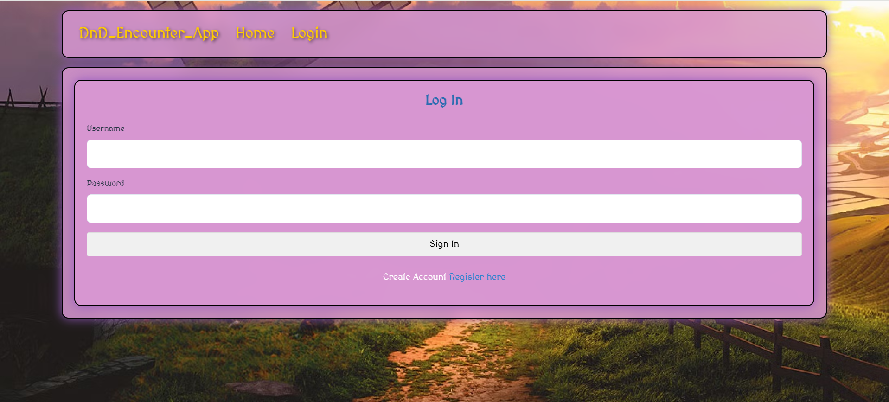
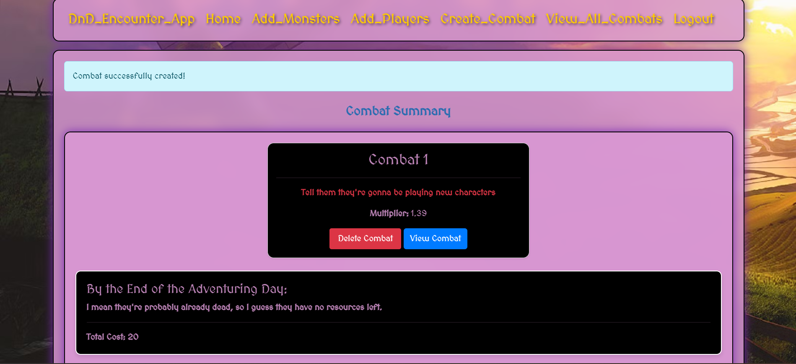

# Link for the website:  (Have to Redeploy) (AWS free tier only lasts a year :( )

http://ec2-3-144-122-27.us-east-2.compute.amazonaws.com/auth/user/login?next=%2Fcombat-summary 

# Summary 
In DnD (a popular TTRPG) 5e, combat is notoriously hard to plan as a DM. There is supposed to be a system in place created by DND to calculate the difficulty of encounters. Players have levels that correspond to a certain power and monsters have a certain Challenge Rating (CR) assigned to them. Based off of this, you can calculate how difficult a fight is supposed to be. However, these calculations are lacking due to a couple of factors. 

One, how combat is supposed to be used in 5e. In 5e, DnD expects parties to go through multiple combats between every short and long rest. This means that players are expected to have less utility for fights and thus they have a lower fighting potential. However, if your party does not do multiple fights per rest as many do not, the calculations are going to say fights that your party easily goes through are deadly. 

Two, it does not account for action economy. The current system assumes that if you go from 1 enemy to 2 enemies, it doubles the difficulty. However, when you double those enemies, it doubles the number of actions they have and thus how much damage they can do as well as how much damage the players need to deal. This makes it close to quadratic. 

As a result of these two factors, I wanted to create a web app that allows users to calculate the difficulty of a DnD combat regardless of how many fights they have been in. I do this by assigning power scores to player level and to CR. After that I have the user input the players and their levels as well as the monsters and their CRs. With the new understanding of how number of enemies impacts the difficulty, I have a calculation to give a number. This number assigns the difficulty of a single fight. After this, I have a party day score which factors in all of the fights of that day. It gives a calculation to determine what percent of resources the party has at the end of the day. 

# Languages and Software used 

I utilized Python, HTML, CSS, Bootstrap, SQL Alchemy, and Flask for this project. 

#Images 

